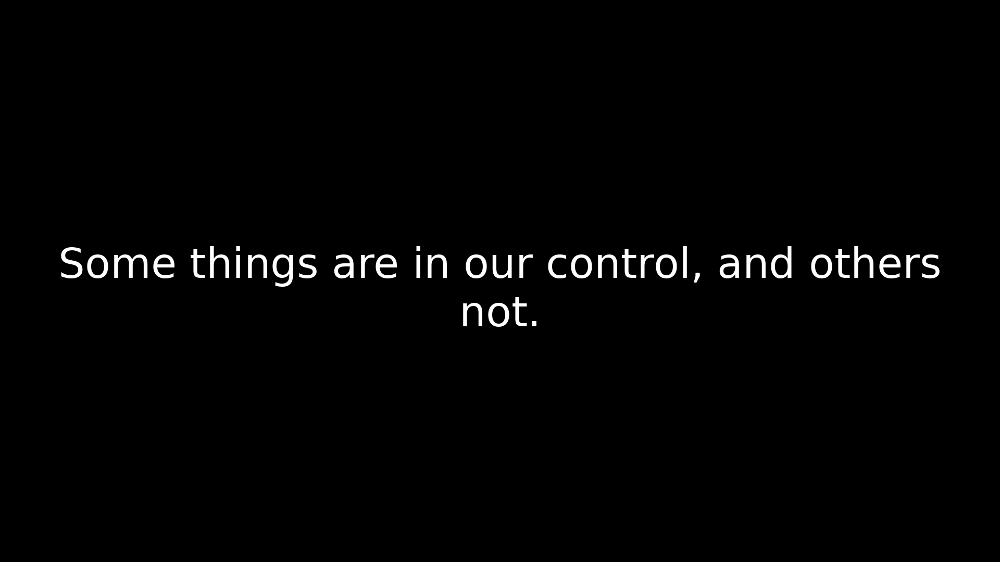

# **📜 WallpaperFromQuotes**  
**Automatically generate wallpapers from text quotes**  
🔹 **1920×1080** resolution  
🔹 **AMOLED black background**  
🔹 **Text centered & word-wrapped**  
🔹 **Customizable font, margins, and text size**  

---

## **📥 Installation**  
1. **Clone the repository**  
   ```bash
   git clone https://github.com/spignelon/WallpaperFromQuotes.git
   cd WallpaperFromQuotes
   ```

2. **Install dependencies**  
   ```bash
   pip install -r requirements.txt
   ```

---

## **🚀 Usage**  
1. **Prepare a text file (`quotes.txt`)**  
   The file should contain quotes in the format:  
   ```
   1. The only thing you control is your own mind.
   2. He who has conquered himself is free.
   # Wisdom Section (ignored)
   3. Don't explain your philosophy. Embody it.
   ```

2. **Run the script**  
   ```bash
   python3 quotes_wallpaper_generator.py quotes.txt
   ```

3. **Find wallpapers in the `wallpapers/` folder**  
   Each quote gets a separate `.png` image.

---

## **⚙️ Customization**  
Modify the script variables to change font, margins, text size, etc.

### **🖋 Font Settings**  
You must specify a valid **TrueType Font (TTF) file** for text rendering.  

- **Linux (Example Paths):**  
  ```python
  FONT_PATH = "/usr/share/fonts/truetype/dejavu/DejaVuSans.ttf"
  ```
  Other common locations:  
  - `/usr/share/fonts/`  
  - `~/.fonts/`  

- **Windows (Example Paths):**  
  ```python
  FONT_PATH = "C:/Windows/Fonts/arial.ttf"
  ```
  Other common locations:  
  - `C:/Windows/Fonts/`  

Ensure the specified font exists, or download a `.ttf` file and provide its path.

---

### **📏 Adjust Margins & Padding**  
Modify these values in the script to control text spacing:  
```python
PADDING_LEFT = 200    # Increase for more left margin
PADDING_RIGHT = 200   # Increase for more right margin
PADDING_TOP = 100     # Adjust top margin
PADDING_BOTTOM = 100  # Adjust bottom margin
```

### **🔠 Change Font Size**  
```python
MAX_FONT_SIZE = 80    # Starting font size
MIN_FONT_SIZE = 20    # Minimum font size if wrapping is needed
LINE_SPACING = 1.2    # Adjust line height spacing
```

---

## **📷 Example Output**  
✅ **Quote from `quotes.txt`**  
```
1. "Some things are in our control, and others not."
```
⬇️ **Generated Wallpaper**  


---

## **📜 Features**  
✅ **Reads text file & extracts quotes**  
✅ **Removes unwanted single & double quotes**  
✅ **Ensures text is centered & readable**  
✅ **Word-wrapping for long quotes**  
✅ **Adjustable text size & margins**  
✅ **Saves wallpapers in `wallpapers/` directory**  

---

## **📜 License**  
This project is licensed under the **GNU General Public License v3.0**.  
See the [LICENSE](LICENSE) file for details.  